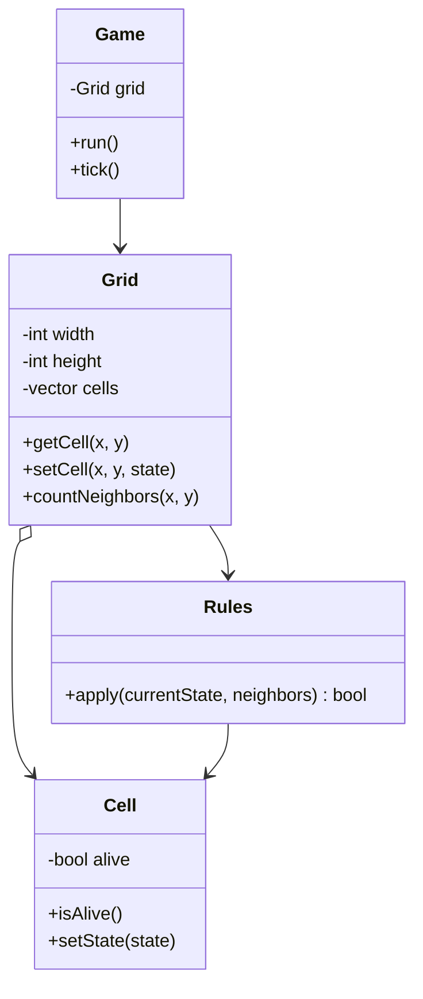

```mermaid
classDiagram
	class Game {
		-Grid grid
		+run()
		+tick()
	}

	class Grid {
		-int width
		-int height
		-vector<Cell> cells
		+getCell(x, y)
		+setCell(x, y, state)
		+countNeighbors(x, y)
	}

	class Cell {
		-bool alive
		+isAlive()
		+setState(state)
	}

	class Rules {
		+apply(currentState, neighbors) bool
	}

	Game --> Grid
	Grid o--> Cell
	Grid --> Rules
	Rules --> Cell
```